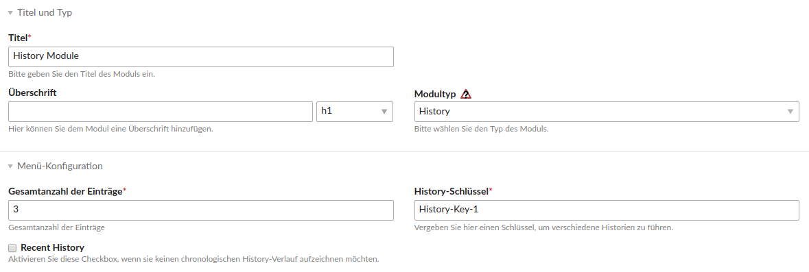

History Bundle
================

Das History Bundle fügt dem Contao Backend ein Frontend Modul hinzu, mit dem Sie einen konfigurierbaren History-Verlauf der zuletzt besuchten Seiten des aktuellen Besuchers auf Ihrer Seite einbinden können. Konfigurierbar ist die Gesamtzahl der Einträge und ob der History-Verlauf in chronologischer Reihenfolge aufgezeichnet wird. Dazu kommt noch ein Feld, in dem der History-Schlüssel eingetragen wird, dieses wird benötigt, falls sie verschiedene Historien führen. Die Frontend Darstellung besteht aus einer Auflistung der besuchten Seiten. Analog zur Contao Paginierung wird ein Listenelement "first" an den Anfang und ein Listenelement "last" an das Ende ergänzt, wodurch die Anzahl der aufgelisteten Seiten die im Backend eingegebene Gesamtzahl der Einträge plus zwei ist. 

---

The history bundle adds a frontend module to the Contao backend, with which you can integrate a configurable history on your page. The total number of entries and whether the history is recorded in chronological order can be configured. There is also a field in which the history key is entered; this is required if you have different histories. The frontend output consists of a list of the pages visited. Analogous to the Contao pagination, a list element "first" is added at the beginning and a list element "last" at the end, therefore the number of pages listed, is the total number of entries entered in the backend plus two.

Screenshots
-----------

History Module

Installation
------------

Install the extension via composer: [trilobit-gmbh/contao-history-bundle](https://packagist.org/packages/trilobit-gmbh/contao-history-bundle).

Compatibility
-------------

- Contao version ~4.4
